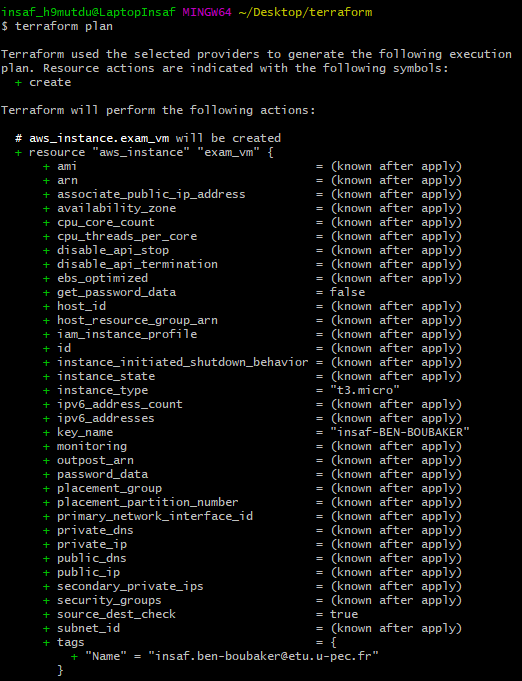
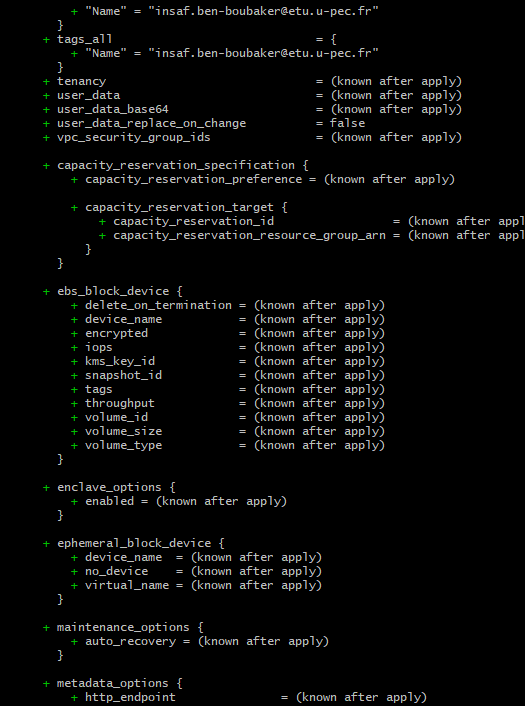
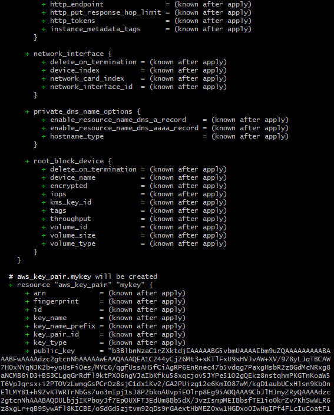
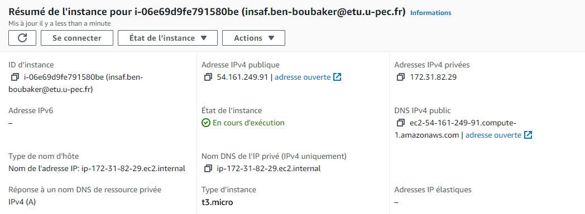
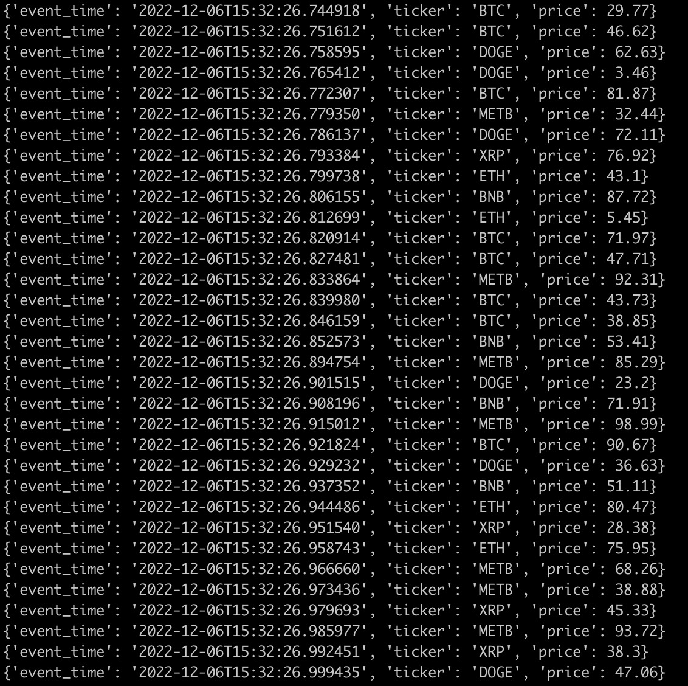
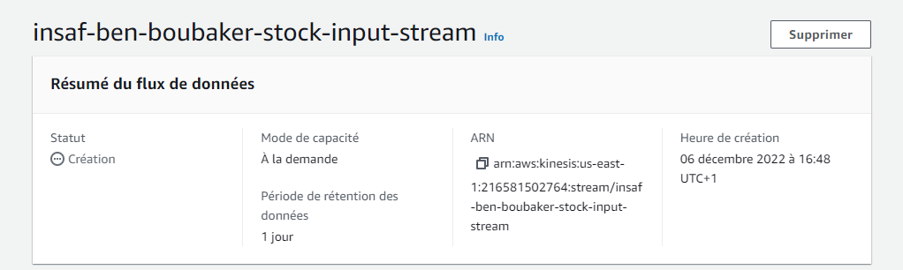
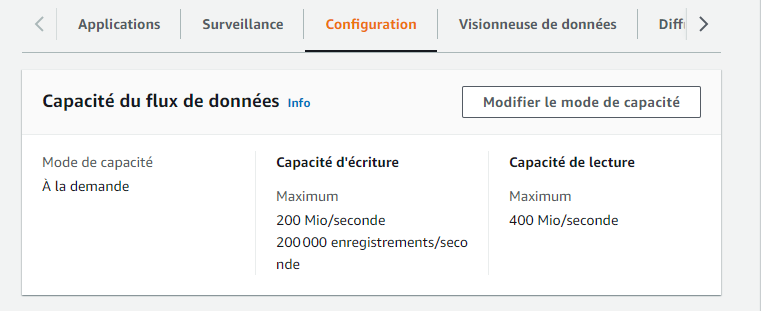
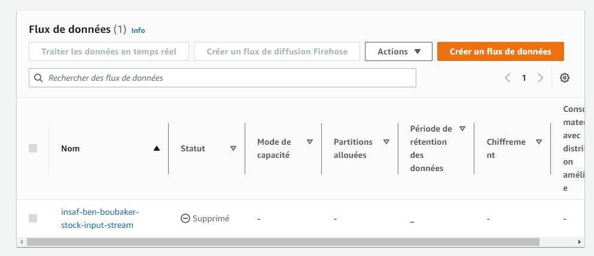
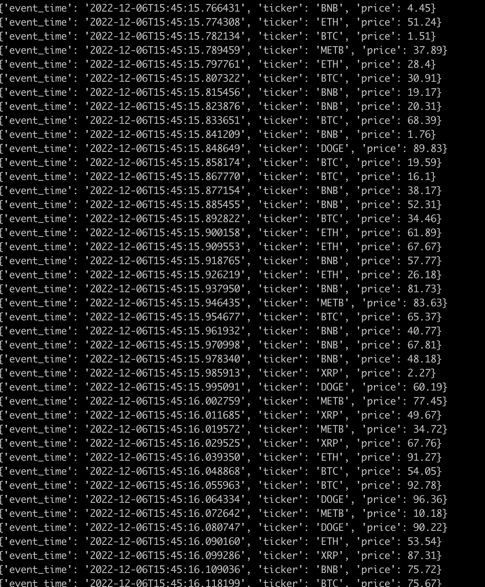

# BEN-BOUBAKER-Insaf-data-pipeline-2022-cc1
Examen final Data Pipeline

Question 1 :

Terraform plan :

VM :

Question 2 :

Question 3:

Question 4.1:

aws kinesis delete-stream --stream-name insaf-ben-boubaker-stock-input-stream

4.2 :

aws kinesis create-stream --stream-name insaf-ben-boubaker-stock-input-stream --shard-count 1

Question 5.1 :
Le data stream n'est pas précisé dans kinesis_client. On ajoute le nom du stream.

5.2 :
Il faut ajouter les accès aws qui sont absents des credentials.

5.3 :

